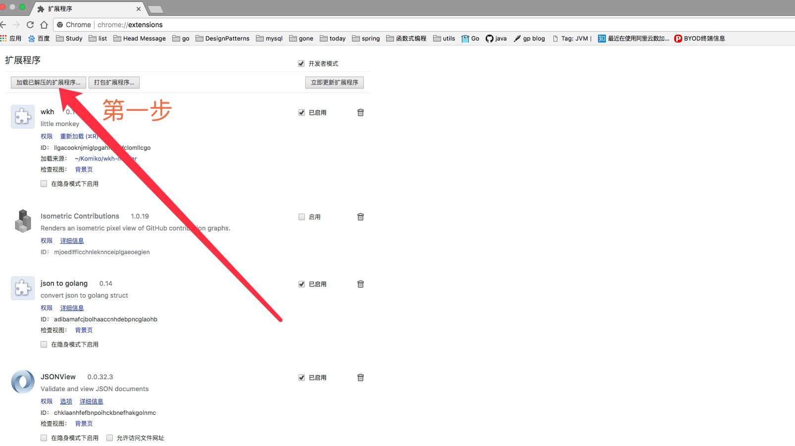
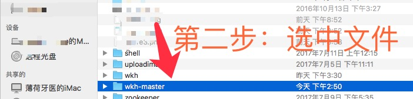
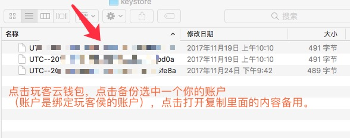
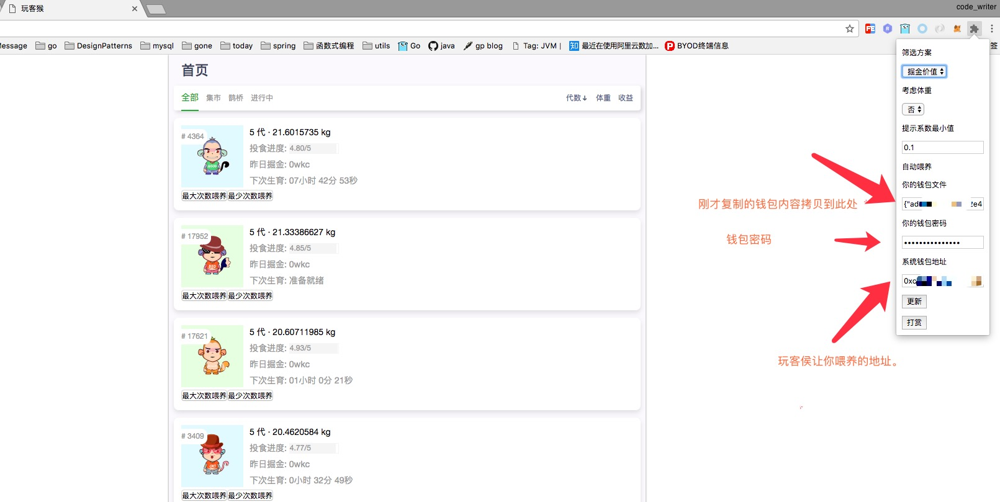

# STEP 1 下载本项目并且使用Chrome加载插件
下载这个 wkh 文件，并在插件中加载该文件，如下图：

# STEP 2 加载wkh文件
加载wkh 这个插件，如下图：

# STEP 3 导入自己的玩客云钱包 地址相关信息，需拷贝自己的私钥，备用 。如下图。

# STEP 4 使用方法，打开玩客侯网站到喂养猴界面：

备注：
#*每次喂饱一只猴子会向作者转账0.4WKC*

